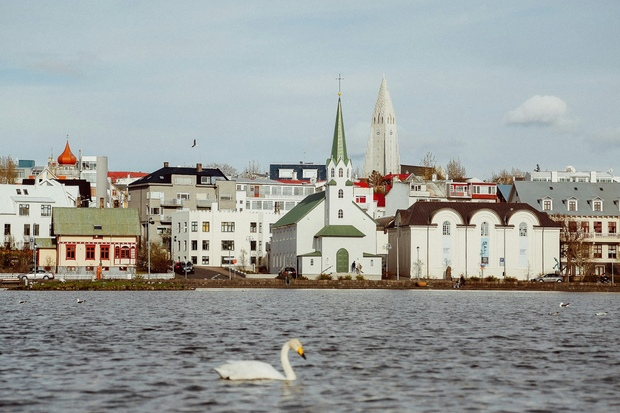
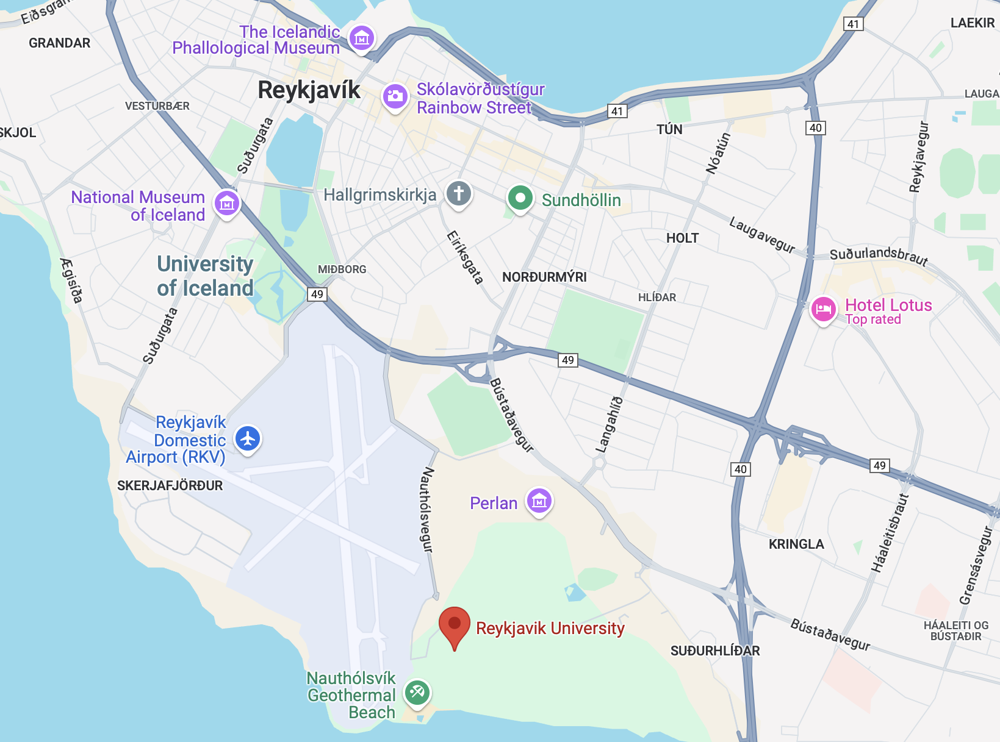

# 15th Nordic Combinatorial Conference

The [Nordic Combinatorial
Conferences](https://www.nordiccombinatorics.org/) are held every third
year – the venue and organisation rotating among the Nordic
countries. At NORCOM, mathematicians from the Nordic countries as well
as from other countries meet and interact in an informal, relaxed
atmosphere. All fields of mathematics related to combinatorics and
discrete mathematics are welcome.
\
\
 \

This year the conference is held in Iceland, with lectures taking
place at [Reykjavik University](https://www.ru.is/en).

# Plenary speakers

- [Cecilia Holmgren](https://www.uu.se/en/contact-and-organisation/staff?query=N5-824), Uppsala University
- [Natasha Blitvic](https://www.qmul.ac.uk/maths/profiles/blitvicn.html), Queen Mary University of London

# Registration and contributed talks

To register, start by filling out the first form linked below. During
this process, you can specify if you intend to present a talk. In this
case, you will be asked for a title and an abstract of your talk.

Next, you need to complete the payment form. The registration fee is
**300 EUR**; it includes lunch on all three days and dinner on Tuesday
evening.

Please ensure you submit both the registration and payment forms to
confirm your participation:

- [Registration form](https://forms.gle/giMofhjCgDQJ6BLp9 )
- [Payment form](https://greidslusida.valitor.is/Tengill/y3he6e)

The **deadline** for registering is

- **10 March** if you are contributing a talk; or
- 15 May if you are *not* contributing a talk.

Speakers will be notified on **20 March** whether their talk has been accepted.

The conference venue can accommodate 120 participants and we will have
to close the registration sooner than the deadlines given above if this
cap is reached.

# Schedule

The conference runs from Monday morning 16 June to Wednesday afternoon
18 June. Thus, we recommend that participants arrive on Sunday 15 June.

On June 18 we will be honoring Einar Steingrímsson on his
70th birthday (Einar fest).

A detailed timetable will be provided later.

# Travel

[Keflavík Airport](https://www.kefairport.com/) is Iceland's main hub for international travel.

#  Organizing committee

- [Henning Ulfarsson](https://permutatriangle.github.io/authors/ulfarsson.html) (chair), Reykjavik University
- [Anders Claesson](https://akc.is/) (cochair), University of Iceland
- [Guilio Cerbai](https://sites.google.com/view/giulio-cerbai/), University of Iceland
- Reed Acton, Reykjavik University

#  Steering committee

- [Petter Brändén](https://www.kth.se/profile/pbranden), KTH Royal Institute of Technology
- [Anders Claesson](https://english.hi.is/staff/akc), University of Iceland
- [Olav Geil](https://people.math.aau.dk/~olav/), Aalborg University
- [Trygve Johnsen](https://en.uit.no/ansatte/trygve.johnsen), UiT The Arctic University of Norway
- [Patric Östergård](https://users.aalto.fi/~pat/), Aalto University
