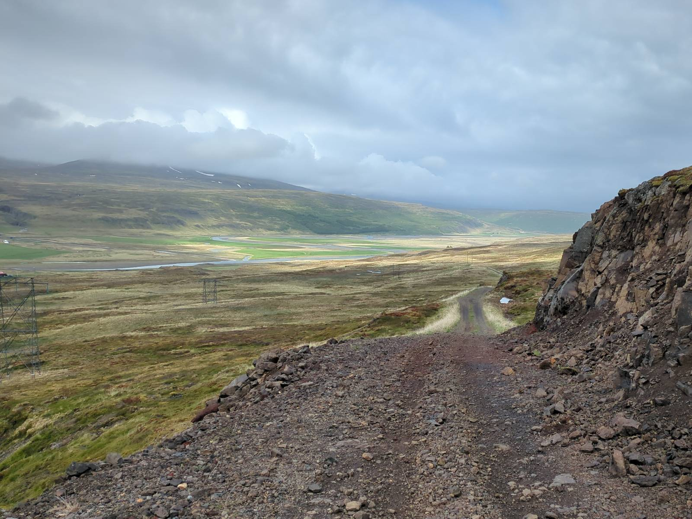

# 15th Nordic Combinatorial Conference

The [Nordic Combinatorial
Conferences](https://www.nordiccombinatorics.org/) are held every third
year – the venue and organisation rotating among the Nordic
countries. At NORCOM, mathematicians from the Nordic countries as well
as from other countries meet and interact in an informal, relaxed
atmosphere. All fields of mathematics related to combinatorics and
discrete mathematics are welcome.
\
\
{ width=38em } \

# Plenary speakers

TBD

# Registration

TBD

# Contributed talks

TBD

# Travel

KEF Keflavík airport

#  Organizing committee

- [Henning Ulfarsson](https://permutatriangle.github.io/authors/ulfarsson.html) (Chair), Reykjavik University
- [Anders Claesson](https://akc.is/), University of Iceland
- [Guilio Cerbai](https://sites.google.com/view/giulio-cerbai/), University of Iceland
- Reed Acton, Reykjavik University

#  Steering committee

- [Petter Brändén](https://www.kth.se/profile/pbranden), KTH Royal Institute of Technology
- [Anders Claesson](https://english.hi.is/staff/akc), University of Iceland
- [Olav Geil](https://people.math.aau.dk/~olav/), University of Aalborg
- [Trygve Johnsen](https://en.uit.no/ansatte/trygve.johnsen), UiT The Arctic University of Norway
- [Patric Östergård](https://users.aalto.fi/~pat/), Aalto University
